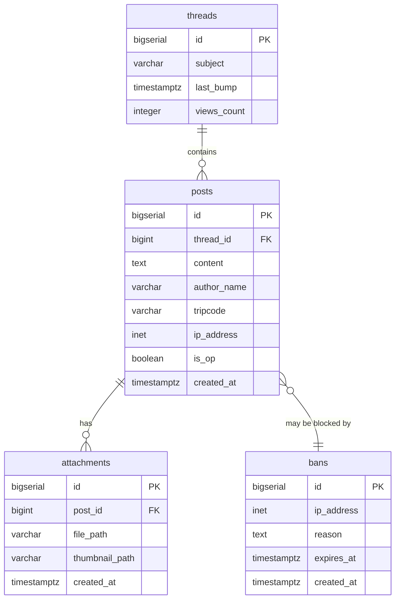

---

# 🗄️ База данных анонимного онлайн-форума

Репозиторий содержит SQL-скрипты для создания и управления базой данных проекта **"Анонимный онлайн-форум"**. База данных реализована на **PostgreSQL** и включает все необходимые таблицы, индексы и связи для функционирования форума.

---

## 📋 Содержание

- [🛠 Технологии](#-технологии)
- [📊 Структура базы данных](#-структура-базы-данных)
- [📁 Миграции](#-миграции)
- [🚀 Установка и настройка](#-установка-и-настройка)
- [📝 Использование](#-использование)
- [👥 Команда проекта](#-команда-проекта)

---

## 🛠 Технологии

| | |
|---|---|
| **СУБД** | PostgreSQL 17 |
| **Клиент** | pgAdmin / DBeaver |
| **Контроль версий** | Git + GitHub |

---

## 📊 Структура базы данных

### Таблицы

| Таблица | Описание |
|---------|----------|
| `threads` | Темы (треды) форума |
| `posts` | Сообщения в темах |
| `attachments` | Медиавложения (изображения) |
| `bans` | IP-блокировки для модерации |

---

### Детальное описание таблиц

#### `threads` (Темы)

| Колонка | Тип | Описание |
|---------|-----|----------|
| `id` | `BIGSERIAL` | Первичный ключ |
| `subject` | `VARCHAR(255)` | Заголовок темы |
| `last_bump` | `TIMESTAMPTZ` | Время последнего ответа (для сортировки) |
| `views_count` | `INTEGER` | Счётчик просмотров |

#### `posts` (Сообщения)

| Колонка | Тип | Описание |
|---------|-----|----------|
| `id` | `BIGSERIAL` | Первичный ключ |
| `thread_id` | `BIGINT` | Внешний ключ к `threads.id` |
| `content` | `TEXT` | Текст сообщения |
| `author_name` | `VARCHAR(50)` | Имя автора (по умолчанию 'Anonymous') |
| `tripcode` | `VARCHAR(64)` | Хеш пароля для идентификации |
| `ip_address` | `INET` | IP-адрес автора |
| `is_op` | `BOOLEAN` | Флаг стартового поста |
| `created_at` | `TIMESTAMPTZ` | Время публикации |

#### `attachments` (Вложения)

| Колонка | Тип | Описание |
|---------|-----|----------|
| `id` | `BIGSERIAL` | Первичный ключ |
| `post_id` | `BIGINT` | Внешний ключ к `posts.id` |
| `file_path` | `VARCHAR(512)` | Путь к оригинальному файлу |
| `thumbnail_path` | `VARCHAR(512)` | Путь к миниатюре |
| `created_at` | `TIMESTAMPTZ` | Время загрузки |

#### `bans` (Блокировки)

| Колонка | Тип | Описание |
|---------|-----|----------|
| `id` | `BIGSERIAL` | Первичный ключ |
| `ip_address` | `INET` | Заблокированный IP (уникальный) |
| `reason` | `TEXT` | Причина блокировки |
| `expires_at` | `TIMESTAMPTZ` | Дата истечения бана |
| `created_at` | `TIMESTAMPTZ` | Время создания блокировки |

---

### Индексы

| Индекс | Таблица | Назначение |
|--------|---------|------------|
| `idx_threads_last_bump` | `threads` | Сортировка тем по активности |
| `idx_posts_thread_id` | `posts` | Быстрая загрузка сообщений темы |
| `idx_posts_ip_address` | `posts` | Поиск по IP для модерации |
| `idx_posts_tripcode` | `posts` | Поиск сообщений по трипкоду |
| `idx_posts_tripcode_created` | `posts` | История сообщений пользователя |
| `idx_bans_ip_expires` | `bans` | Проверка блокировок по IP |

---

### Схема данных



---

## 📁 Миграции

Все изменения структуры базы данных хранятся в папке `/migrations` в хронологическом порядке:

| Файл | Описание |
|------|----------|
| `001_init.sql` | Начальная структура: создание всех таблиц и базовых индексов |
| `002_add_views_counter.sql` | Добавление поля `views_count` в таблицу `threads` |
| `003_add_tripcode_index.sql` | Добавление индексов для оптимизации поиска по трипкоду |

---

## 🚀 Установка и настройка

### Быстрый старт

1. **Установите PostgreSQL 17** (если ещё не установлен)

2. **Создайте базу данных**:
   ```sql
   CREATE DATABASE anonymous_forum;
   ```

3. **Примените миграции**:
   ```bash
   # Применить начальную структуру
   psql -U postgres -d anonymous_forum -f migrations/001_init.sql
   
   # Добавить счётчик просмотров
   psql -U postgres -d anonymous_forum -f migrations/002_add_views_counter.sql
   
   # Добавить индексы для трипкода
   psql -U postgres -d anonymous_forum -f migrations/003_add_tripcode_index.sql
   ```

### Через pgAdmin

1. Откройте **pgAdmin** и подключитесь к серверу
2. Выберите базу данных `anonymous_forum`
3. Откройте **Query Tool**
4. Скопируйте содержимое нужного SQL-файла и выполните

---

## 📝 Использование

### Тестовые данные (seed)

Для заполнения базы тестовыми данными выполните:

```bash
psql -U postgres -d anonymous_forum -f seed.sql
```

### Проверка созданных индексов

```sql
-- Индексы таблицы posts
SELECT indexname, indexdef 
FROM pg_indexes 
WHERE tablename = 'posts';
```

```sql
-- Индексы таблицы threads
SELECT indexname, indexdef 
FROM pg_indexes 
WHERE tablename = 'threads';
```

### Получение активных тем

```sql
-- Топ-20 самых активных тем
SELECT id, subject, last_bump 
FROM threads 
ORDER BY last_bump DESC 
LIMIT 20;
```

### Поиск сообщений пользователя по трипкоду

```sql
-- Все сообщения конкретного пользователя
SELECT t.subject, p.content, p.created_at
FROM posts p
JOIN threads t ON p.thread_id = t.id
WHERE p.tripcode = 'ваш_трипкод'
ORDER BY p.created_at DESC;
```

---

## 👥 Команда проекта

### Группа равных:

| | |
|---|---|
| **Пташко А.А.** | разработчик |
| **Суравикин Ф.С.** | разработчик |

---

**Кубанский государственный университет (КубГУ)**  
*Кафедра информационных технологий*  
**Дисциплина:** *"Коллективная разработка приложений"*

---
